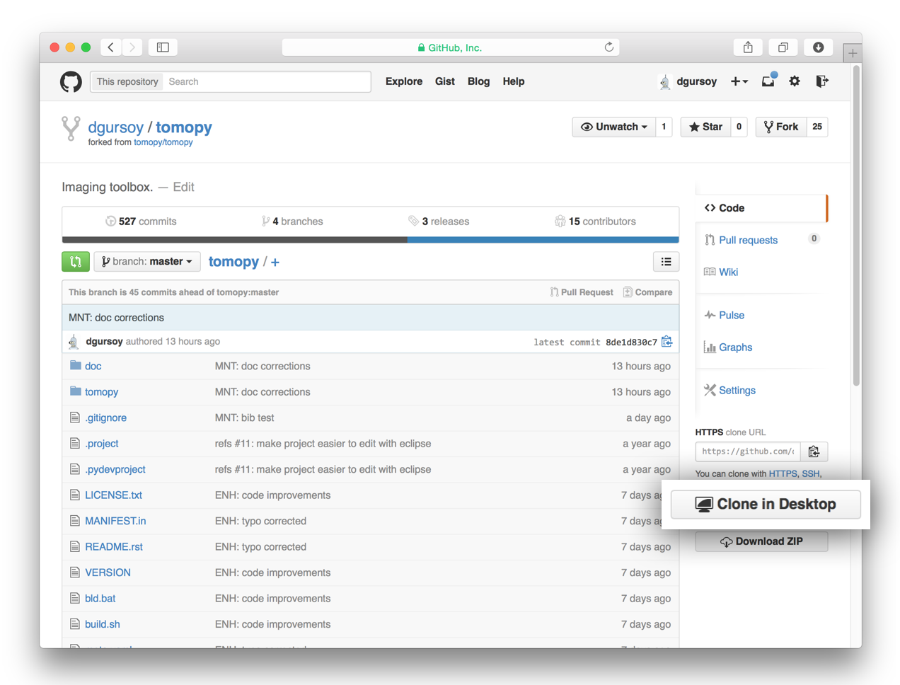
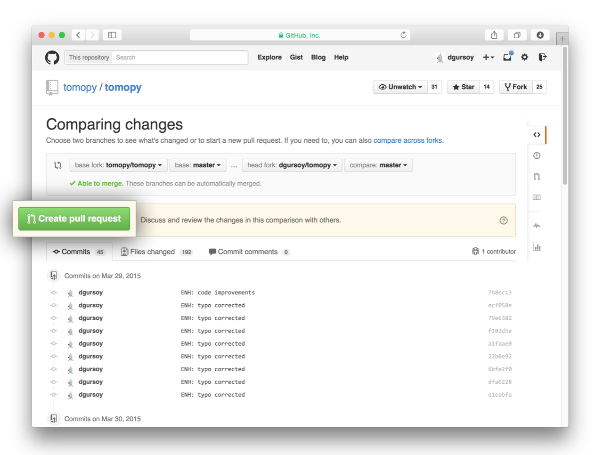

=================
Developer's Guide
=================

:Page Status: Incomplete
:Last Reviewed: 2015-03-14

This section is for TomoPy developers.

.. contents:: Contents
   :local:

How to contribute?
==================

Cloning the repository
----------------------

The project is maintained on GitHub, which is a version control and a 
collaboration platform for software developers. To start first register 
on `GitHub <https://github.com>`_ and fork the TomoPy repository by 
clicking the **Fork** button in the header of the 
`TomoPy repository <https://github.com/dgursoy/tomopy>`__: 

This successfully creates a copy of the project in your personal 
GitHub space. The next thing you want to do is to clone it to your 
local machine. You can do this by clicking the **Clone in Desktop** 
button in the bottom of the right hand side bar:

.. image:: img/clone-in-desktop.png

Commiting changes
-----------------

Make a change in the code, for example, add a function to one of the
TomoPy modules. The changes you made are now visible in GitHub App. When
you are happy with the changes, write a brief *Summary* and *Description* 
about the changes you made and click the **Commit** button. 

.. image:: img/commit-screen.png

You can continue to make changes, add modules, write your own functions, 
and take more *Commit* snapshots of your development process. 

.. note:: Some developers may prefer using basic Git terminal commands. 
    You can learn more on this by reading the 
    `Fork a Repo guide <https://help.github.com/articles/fork-a-repo/>`__.

Coding Syntax
=============

TomoPy uses the following style guides for code development:

1. `PEP8 <https://www.python.org/dev/peps/pep-0008/>`__ for Python 
   codes.

2. `PEP7 <https://www.python.org/dev/peps/pep-0007/>`_ for C codes.

3. `PEP287 <https://www.python.org/dev/peps/pep-0287/>`_ for 
   Python docstring

It is recommended to use the Python packages 
`pep8 <https://pypi.python.org/pypi/pep8>`__ and 
`pyFlakes <https://pypi.python.org/pypi/pyflakes>`_ to check for
syntax and warnings. They are available in
`Conda <http://docs.continuum.io/anaconda/pkg-docs.html>`__
as well as in `PyPI <https://pypi.python.org>`_.

Style for Git commit messages
-----------------------------

Here is a list of abbreviations and corresponding descriptions for 
writing your commit summaries: 

* API: api related commits

* BLD: changes related to building

* BUG: bug fixes

* DOC: documentation

* ENH: enhancement

* MNT: maintenance

* STR: code restructuring, moving files

* TST: addition or modification of tests

* WIP: for work in progress

Additional Remarks
------------------

Function naming conventions: 

Testing
=======

Add the test scripts for the package or module in ``tomopy/tests``. To see
the test coverage use the following command::

    nosetests

See ``setup.cfg`` for `nose <http://nose.readthedocs.org/en/latest/index.html>`_ configuration.

Contributing back
=================

Once you feel that the functionality you added would benefit the community, 
then you should consider contributing back to the TomoPy project. For this, 
go to your online GitHub repository of the project and click on the *green*
button to compare, review and create a pull request.

.. image:: img/create-revision.png

After clicking on the **Compare and Review** button, you are presented 
with a review page where you can get a high-level overview of what exactly 
has changed between your forked branch and the original TomoPy repository. 
When you're ready to submit your pull request, click **Create pull request**.

Clicking on **Create pull request** sends you to a discussion page,  
where you can enter a title and optional description. It’s important to  
provide as much useful information and a rationale for why you’re making  
this Pull Request in the first place. The project owner needs to be able to 
determine whether your change is as useful to everyone as you think it is.

When you’re ready typing out your heartfelt argument, click on **Send 
pull request**. You’re done! 

Conda Packaging
===============

Run the following command from a terminal to build the 
`Conda <https://store.continuum.io>`__  package for TomoPy::

    conda build /path/to/tomopy/folder

