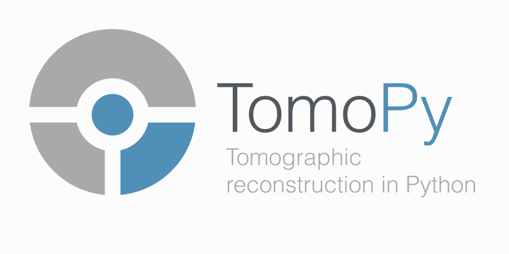

| 

TomoPy is an open-sourced Python toolbox to perform tomographic data 
processing and image reconstruction tasks at the 
`Advanced Photon Source <http://www.aps.anl.gov>`_.

This guide and the TomoPy project is maintained on 
`GitHub <https://github.com/dgursoy/tomopy>`_.

.. warning:: This is a beta version for testing!

.. toctree::
   :maxdepth: 2
   
   about
   install
   quickstart
   userguide
   developer
   api
   questions
   credits

Indices and tables
==================

* :ref:`genindex`
* :ref:`modindex`
* :ref:`search`

