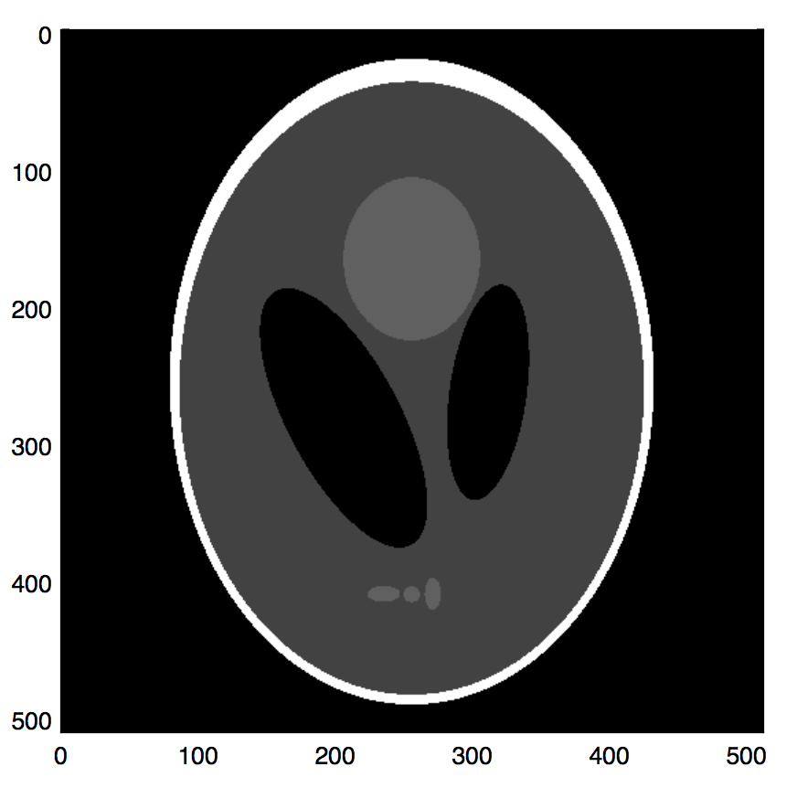
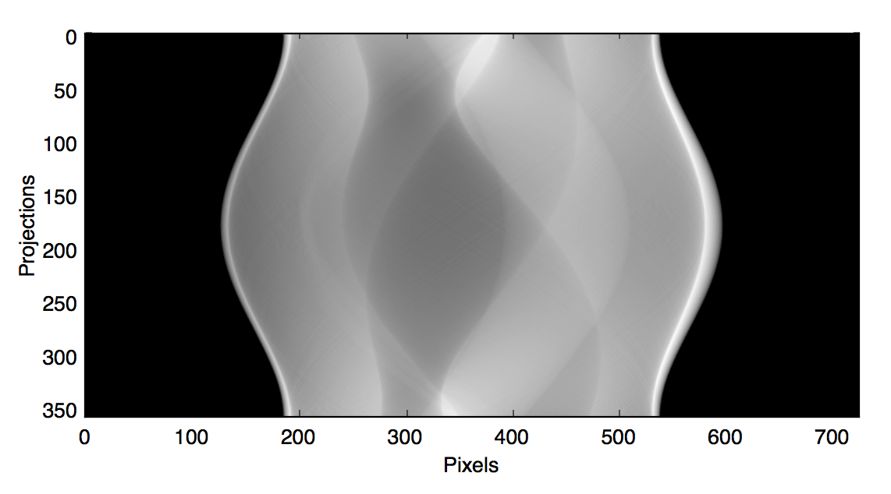

================
Quickstart Guide
================

:Page Status: Incomplete
:Last Reviewed: 2015-04-03

This section gives a quick start on how to simulate data and reconstruct 
objects from tomography data with TomoPy.

.. contents:: Contents
   :local:

Data simulation
===============

Let us first import the `Shepp-Logan phantom <http://en.wikipedia.org/wiki/Shepp–Logan_phantom>`_ 
first::

    >>> import tomopy
    >>> obj = tomopy.shepp2d()
    >>> print(obj.shape)
    (1, 512, 512)

This creates a single slice of the 3-D phantom::

    >>> import matplotlib.pylab as plt
    >>> plt.imshow(obj[0], cmap='gray')
    >>> plt.show()

We can then define the projection angles and pass it with the generated 
object to ``simulate`` function::

    >>> import numpy as np
    >>> theta = np.linspace(0, np.pi, 360)
    >>> data = tomopy.simulate(obj, theta)
    >>> print(data.shape)
    (90, 1, 725)

Then we can image the sinogram::

    >>> plt.imshow(data[:,0,:], cmap='gray')
    >>> plt.xlabel('Pixels')
    >>> plt.ylabel('Projections')
    >>> plt.show()

Image reconstruction
====================
