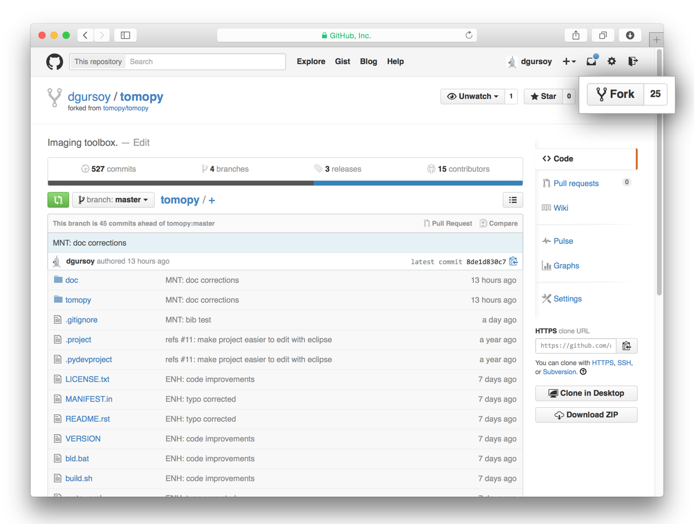
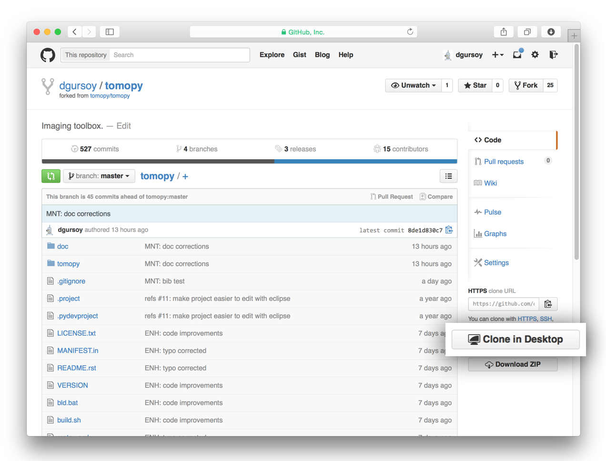
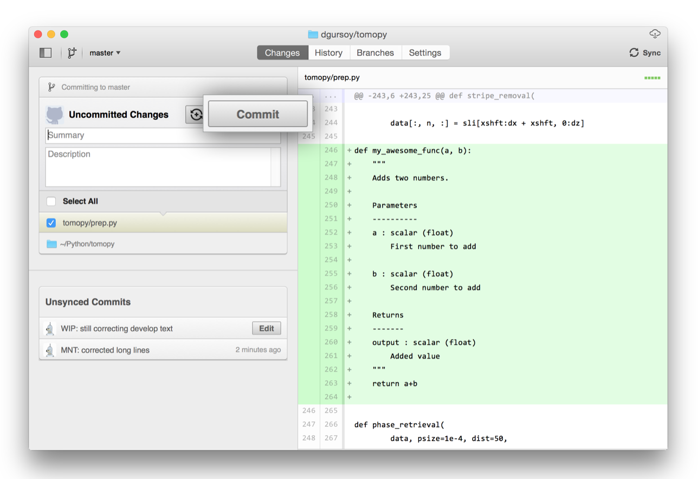
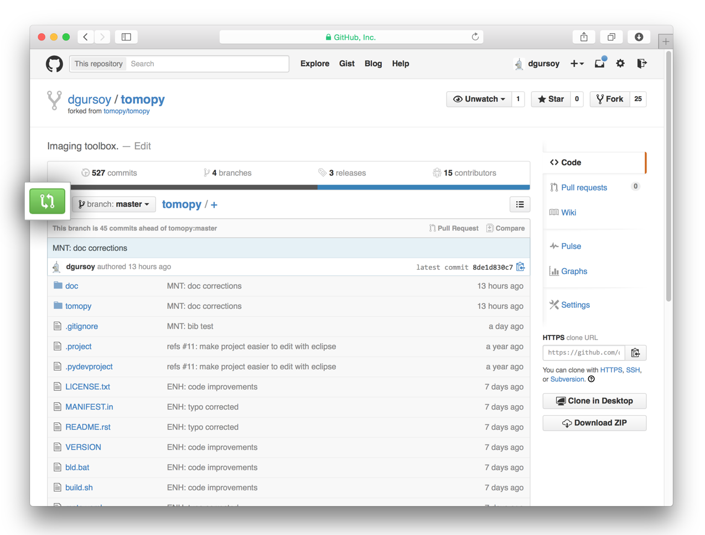
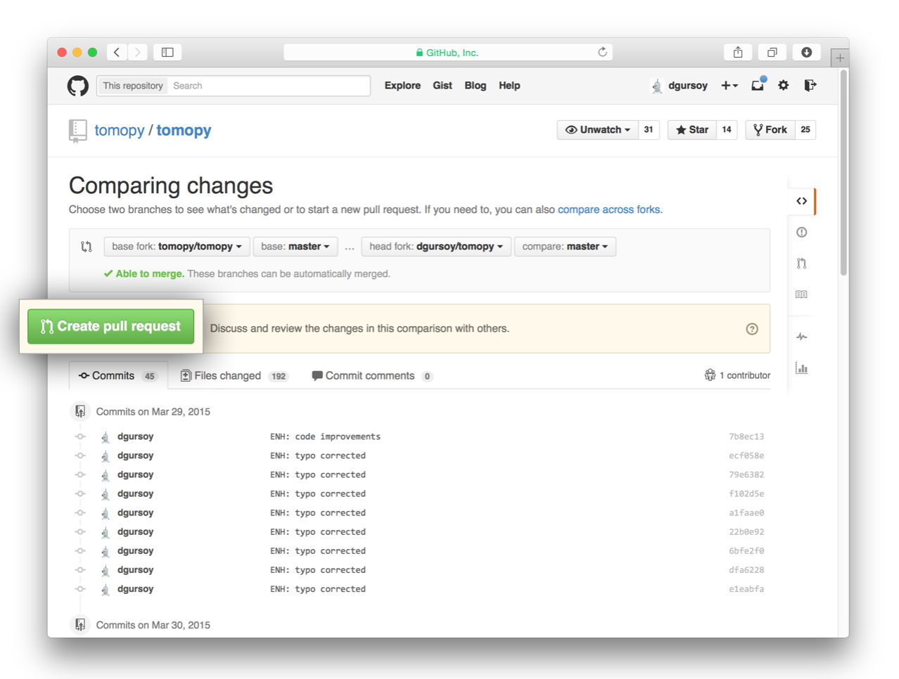

=================
Development Guide
=================

This section explains the basics for developers who wish to contribute
to the TomoPy project.

.. contents:: Contents:
   :local:

Cloning the repository
======================

The project is maintained on GitHub, which is a version control and a
collaboration platform for software developers. First register on `GitHub
<https://github.com>`_ and fork (make your own copy of) the TomoPy repository by
clicking the **Fork** button in the header of the `TomoPy repository
<https://github.com/tomopy/tomopy>`__:

This creates a remote copy of the project in your personal GitHub space. Next,
clone a copy of your fork of the project to your local machine. You can do this
by clicking the **Clone in Desktop** button in the bottom of the right hand side
bar:

This will launch the GitHub desktop application
(available for both `Mac <http://mac.github.com>`_ and
`Win <http://windows.github.com>`_)
and ask you where you want to save it. Select a location in your
computer and feel comfortable with making modifications in the code.

.. include:: ../../INSTALL.rst

Running the Tests
=================

TomoPy has a suite of Python unit tests that live in the ``/test`` directory,
where they follow the same tree structure as the packages under ``/tomopy``.
These are automatically run by TravisCI when you make a pull request (See below
for how to do that). You can run them manually using pytest, or whichever python
test runner you prefer.  To make it easier to run tests on the changes you make
to the code, it is recommended that you install TomoPy in development mode.
(`python setup.py develop`)

The `pytest test runner <http://doc.pytest.org/en/latest/>`__, is available
through pip or anaconda.

To run the tests open a terminal, navigate to your project folder, then run
``py.test``.

To run sections of tests, pass py.test a directory or filepath, as in ``py.test
test/test_recon`` or ``py.test test/test_recon/test_rotation.py``.

When writing tests, at minimum we try to check all function returns with
synthetic data, together with some dimension, type, etc. Writing tests is highly
encouraged!

Coding conventions
==================

We try to keep our code consistent and readable. So, please keep
in mind the following style and syntax guidance before you start
coding.

First of all the code should be well documented, easy to understand,
and integrate well into the rest of the project. For example, when you
are writing a new function always describe the purpose and the
parameters::

    def my_awesome_func(a, b):
        """
        Adds two numbers.

        Parameters
        ----------
        a : scalar (float)
            First number to add

        b : scalar (float)
            Second number to add

        Returns
        -------
        output : scalar (float)
            Added value
        """
        return a+b

Package versioning
==================

We follow the X.Y.Z (Major.Minor.Patch) semantic for package versioning. The
patch number is incremented for minor changes and bug fixes which do not change
the software's API. The minor version is incremented for releases which add new,
but backward-compatible, API features, and the major version is incremented for
API changes which are not backward-compatible. For example, software which
relies on version 2.1.5 of an API is compatible with version 2.2.3, but not
necessarily with 3.2.4.

We manage our versions using git tags, and the `setuptools_scm` package.

Committing changes
==================

After making some changes in the code, take a *snapshot* of the edits you made.
That's when you make a *commit*. To do this, launch the GitHub desktop
application and it should provide you all the changes in your code since your
last commit. Write a brief *Summary* and *Description* about the changes you
made and click the **Commit** button:

Remember that you are writing these messages to help other people understand the
changes that you have made to the code.

Publishing your changes
=======================

Once you feel that the functionality you added would benefit the community, then
you should consider contributing back to the TomoPy project. You will need to
push your local commits to GitHub, then go to your online GitHub repository of
the project and click on the *green* button to compare, review, and create a
pull request.

After clicking on this button, you are presented with a review page where you
can get a high-level overview of what exactly has changed between your forked
branch and the original TomoPy repository. When you're ready to submit your pull
request, click **Create pull request**:

Clicking on **Create pull request** sends you to a discussion page, where you
can enter a title and helpful description. It’s important to provide as much
useful information and a rationale for why you’re making this Pull Request in
the first place.

When you’re ready typing out your heartfelt argument, click on **Send pull
request**. You’re done!

.. This text is partially adopted from GitHub guides and Wikipedia.
