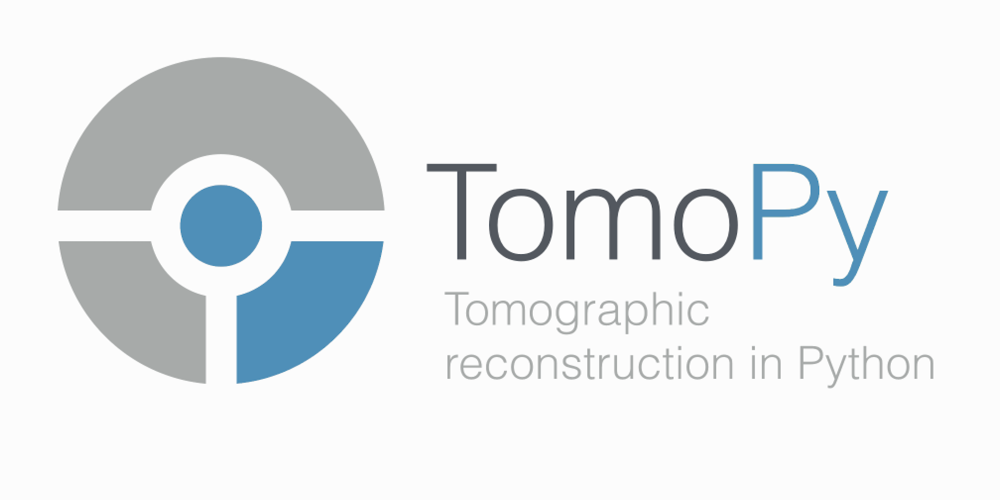

.. title:: TomoPy

`TomoPy <https://github.com/tomopy/tomopy.git>`_ is an open-source 
Python package for tomographic data processing and image reconstruction.

Features
========

* Image reconstruction algorithms for tomography.
* Various filters, ring removal algorithms, phase retrieval algorithms.
* Forward projection operator for absorption and wave propagation.
    
Contribute
==========

* Issue Tracker: https://github.com/tomopy/tomopy/issues
* Documentation: https://github.com/tomopy/tomopy/tree/master/doc
* Source Code: https://github.com/tomopy/tomopy/tree/master/tomopy
* Tests: https://github.com/tomopy/tomopy/tree/master/test

Table of Contents
=================

.. toctree::
   :maxdepth: 1
   
   about
   install
   data
   devguide
   releases
   api
   demo
   faq
   credits

License
=======

The project is licensed under the 
`BSD-3 <https://github.com/tomopy/tomopy/blob/master/LICENSE.txt>`_ license.

Indices and tables
==================

* :ref:`genindex`
* :ref:`modindex`
* :ref:`search`

