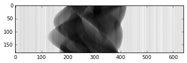
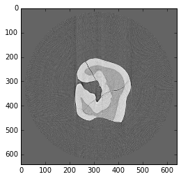
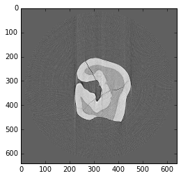
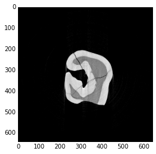

Using the ASTRA toolbox through TomoPy
--------------------------------------

Here is an example on how to use the `ASTRA
toolbox <http://www.astra-toolbox.com>`__ through its integration with
`TomoPy <http://tomopy.readthedocs.io/en/latest/>`__, as published in :cite:`Pelt:16a`.

.. code:: python

    %pylab inline

Install the `ASTRA
toolbox <http://www.astra-toolbox.com/docs/install.html>`__ and
`TomoPy <http://tomopy.readthedocs.io/en/latest/install.html>`__ then:

.. code:: python

    import tomopy

`DXchange <http://dxchange.readthedocs.io>`__ is installed with tomopy
to provide support for tomographic data loading. Various data format
from all major
`synchrotron <http://dxchange.readthedocs.io/en/latest/source/demo.html>`__
facilities are supported.

.. code:: python

    import dxchange

matplotlib provide plotting of the result in this notebook.
`Paraview <http://www.paraview.org/>`__ or other tools are available for
more sophisticated 3D rendering.

.. code:: python

    import matplotlib.pyplot as plt

Set the path to the micro-CT data to reconstruct.

.. code:: python

    fname = '../../tomopy/data/tooth.h5'

Select the sinogram range to reconstruct.

.. code:: python

    start = 0
    end = 2

This data set file format follows the `APS <http://www.aps.anl.gov>`__
beamline `2-BM and 32-ID <https://www1.aps.anl.gov/Imaging>`__
definition. Other file format readers are available at
`DXchange <http://dxchange.readthedocs.io/en/latest/source/api/dxchange.exchange.html>`__.

.. code:: python

    proj, flat, dark, theta = dxchange.read_aps_32id(fname, sino=(start, end))

Plot the sinogram:

.. code:: python

    plt.imshow(proj[:, 0, :], cmap='Greys_r')
    plt.show()

If the angular information is not avaialable from the raw data you need
to set the data collection angles. In this case theta is set as equally
spaced between 0-180 degrees.

.. code:: python

    if (theta is None):
        theta = tomopy.angles(proj.shape[0])
    else:
        pass

Perform the flat-field correction of raw data:

.. math::  \frac{proj - dark} {flat - dark} 

.. code:: python

    proj = tomopy.normalize(proj, flat, dark)

Tomopy provides various methods to `find rotation
center <http://tomopy.readthedocs.io/en/latest/api/tomopy.recon.rotation.html>`__.

.. code:: python

    rot_center = tomopy.find_center(proj, theta, init=290, ind=0, tol=0.5)

Calculate

.. math::  -log(proj) 

.. code:: python

    proj = tomopy.minus_log(proj)

Reconstruction with TomoPy
^^^^^^^^^^^^^^^^^^^^^^^^^^

Reconstruction can be performed using either TomoPy's algorithms, or the
algorithms of the ASTRA toolbox.

To compare, we first show how to reconstruct an image using TomoPy's
Gridrec algorithm:

.. code:: python

    recon = tomopy.recon(proj, theta, center=rot_center, algorithm='gridrec')

Mask each reconstructed slice with a circle.

.. code:: python

    recon = tomopy.circ_mask(recon, axis=0, ratio=0.95)

.. code:: python

    plt.imshow(recon[0, :,:], cmap='Greys_r')
    plt.show()

Reconstruction with the ASTRA toolbox
^^^^^^^^^^^^^^^^^^^^^^^^^^^^^^^^^^^^^

To reconstruct the image with the ASTRA toolbox instead of TomoPy,
change the ``algorithm`` keyword to ``tomopy.astra``, and specify the
projection kernel to use (``proj_type``) and which ASTRA algorithm to
reconstruct with (``method``) in the ``options`` keyword.

More information about the projection kernels and algorithms that are
supported by the ASTRA toolbox can be found in the documentation:
`projection kernels <http://www.astra-toolbox.com/docs/proj2d.html>`__
and `algorithms <http://www.astra-toolbox.com/docs/algs/index.html>`__.
Note that only the 2D (i.e. slice-based) algorithms are supported when
reconstructing through TomoPy.

For example, to use a line-based CPU kernel and the FBP method, use:

.. code:: python

    options = {'proj_type':'linear', 'method':'FBP'}
    recon = tomopy.recon(proj, theta, center=rot_center, algorithm=tomopy.astra, options=options)
    recon = tomopy.circ_mask(recon, axis=0, ratio=0.95)
    plt.imshow(recon[0, :,:], cmap='Greys_r')
    plt.show()

If you have a CUDA-capable NVIDIA GPU, reconstruction times can be
greatly reduced by using GPU-based algorithms of the ASTRA toolbox,
especially for iterative reconstruction methods.

To use the GPU, change the ``proj_type`` option to ``'cuda'``, and use
CUDA-specific algorithms (e.g. ``'FBP_CUDA'`` for FBP):

.. code:: python

    options = {'proj_type':'cuda', 'method':'FBP_CUDA'}
    recon = tomopy.recon(proj, theta, center=rot_center, algorithm=tomopy.astra, options=options)
    recon = tomopy.circ_mask(recon, axis=0, ratio=0.95)
    plt.imshow(recon[0, :,:], cmap='Greys_r')
    plt.show()

Many algorithms of the ASTRA toolbox support additional options, which
can be found in the
`documentation <http://www.astra-toolbox.com/docs/algs/index.html>`__.
These options can be specified using the ``extra_options`` keyword.

For example, to use the GPU-based iterative SIRT method with a
nonnegativity constraint, use:

.. code:: python

    extra_options ={'MinConstraint':0}
    options = {'proj_type':'cuda', 'method':'SIRT_CUDA', 'num_iter':200, 'extra_options':extra_options}
    recon = tomopy.recon(proj, theta, center=rot_center, algorithm=tomopy.astra, options=options)
    recon = tomopy.circ_mask(recon, axis=0, ratio=0.95)
    plt.imshow(recon[0, :,:], cmap='Greys_r')
    plt.show()

