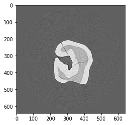
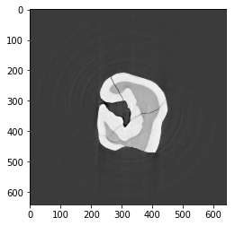
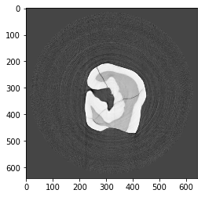
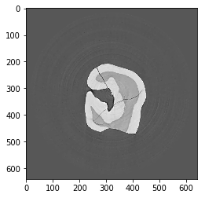

LPrec
-----

Here is an example on how to use the log-polar based method
(https://github.com/math-vrn/lprec) for reconstruction in Tomopy

.. code:: ipython3

    %pylab inline

Install lprec from github, then

.. code:: ipython3

    import tomopy

`DXchange <http://dxchange.readthedocs.io>`__ is installed with tomopy
to provide support for tomographic data loading. Various data format
from all major
`synchrotron <http://dxchange.readthedocs.io/en/latest/source/demo.html>`__
facilities are supported.

.. code:: ipython3

    import dxchange

matplotlib provide plotting of the result in this notebook.
`Paraview <http://www.paraview.org/>`__ or other tools are available for
more sophisticated 3D rendering.

.. code:: ipython3

    import matplotlib.pyplot as plt

Set the path to the micro-CT data to reconstruct.

.. code:: ipython3

    fname = '../../tomopy/data/tooth.h5'

Select the sinogram range to reconstruct.

.. code:: ipython3

    start = 0
    end = 2

This data set file format follows the `APS <http://www.aps.anl.gov>`__
beamline `2-BM and 32-ID <https://www1.aps.anl.gov/Imaging>`__
definition. Other file format readers are available at
`DXchange <http://dxchange.readthedocs.io/en/latest/source/api/dxchange.exchange.html>`__.

.. code:: ipython3

    proj, flat, dark, theta = dxchange.read_aps_32id(fname, sino=(start, end))

Plot the sinogram:

.. code:: ipython3

    plt.imshow(proj[:, 0, :], cmap='Greys_r')
    plt.show()

.. image:: lprec_files/output_15_0.png

If the angular information is not avaialable from the raw data you need
to set the data collection angles. In this case theta is set as equally
spaced between 0-180 degrees.

.. code:: ipython3

    theta = tomopy.angles(proj.shape[0])

Perform the flat-field correction of raw data:

.. math::  \frac{proj - dark} {flat - dark} 

.. code:: ipython3

    proj = tomopy.normalize(proj, flat, dark)

Select the rotation center manually

.. code:: ipython3

    rot_center = 296

Calculate

.. math::  -log(proj) 

.. code:: ipython3

    proj = tomopy.minus_log(proj)
    proj[proj<0] = 0

Reconstruction using FBP method with the log-polar coordinates

.. math::  \hat{f}=\mathcal{W}\mathcal{R}^* g 

.. code:: ipython3

    recon = tomopy.recon(proj, theta, center=rot_center, algorithm=tomopy.lprec, lpmethod='fbp', filter_name='parzen')
    recon = tomopy.circ_mask(recon, axis=0, ratio=0.95)
    plt.imshow(recon[0, :,:], cmap='Greys_r')
    plt.show()

Reconstruction using the gradient descent method with the log-polar
coordinates

.. math::  \hat{f} = \text{argmin}_f\lVert\mathcal{R}f-g \rVert_2^2 

.. code:: ipython3

    recon = tomopy.recon(proj, theta, center=rot_center, algorithm=tomopy.lprec, lpmethod='grad', ncore=1, num_iter=64, reg_par=-1)
    recon = tomopy.circ_mask(recon, axis=0, ratio=0.95)
    plt.imshow(recon[0, :,:], cmap='Greys_r')
    plt.show()

Reconstruction using the conjugate gradient method with the log-polar
coordinates

.. math::  \hat{f} = \text{argmin}_f\lVert\mathcal{R}f-g \rVert_2^2 

.. code:: ipython3

    recon = tomopy.recon(proj, theta, center=rot_center, algorithm=tomopy.lprec, lpmethod='cg', ncore=1, num_iter=16, reg_par=-1)
    recon = tomopy.circ_mask(recon, axis=0, ratio=0.95)
    plt.imshow(recon[0, :,:], cmap='Greys_r')
    plt.show()

Reconstruction using the TV method with the log-polar coordinates. It
gives piecewise constant reconstructions and can be used for denoising.

.. math::  \hat{f} = \text{argmin}_f\lVert\mathcal{R}f-g \rVert_2^2 + \lambda \lVert\nabla f\rVert_1 

.. code:: ipython3

    recon = tomopy.recon(proj, theta, center=rot_center, algorithm=tomopy.lprec, lpmethod='tv', ncore=1, num_iter=512, reg_par=5e-4)
    recon = tomopy.circ_mask(recon, axis=0, ratio=0.95)
    plt.imshow(recon[0, :,:], cmap='Greys_r')
    plt.show()

Reconstruction using the TV-entropy method with the log-polar
coordinates. It can be used for suppressing Poisson noise.

.. math::  \hat{f} = \text{argmin}_f \lambda \lVert\nabla f\rVert_1+\int_\Omega\mathcal{R}f-g\log(\mathcal{R}f)df 

.. code:: ipython3

    recon = tomopy.recon(proj, theta, center=rot_center, algorithm=tomopy.lprec, lpmethod='tve', ncore=1, num_iter=512, reg_par=2e-4)
    recon = tomopy.circ_mask(recon, axis=0, ratio=0.95)
    plt.imshow(recon[0, :,:], cmap='Greys_r')
    plt.show()

Reconstruction using the TV-l1 method with the log-polar coordinates. It
can be used to remove structures of an image of a certain scale, and the
regularization parameter :math:`\lambda` can be used for scale
selection.

.. math::  \hat{f} = \text{argmin}_f\lVert\mathcal{R}f-g \rVert_1 + \lambda \lVert\nabla f\rVert_1 

.. code:: ipython3

    recon = tomopy.recon(proj, theta, center=rot_center, algorithm=tomopy.lprec, lpmethod='tvl1', ncore=1, num_iter=512, reg_par=3e-2)
    recon = tomopy.circ_mask(recon, axis=0, ratio=0.95)
    plt.imshow(recon[0, :,:], cmap='Greys_r')
    plt.show()

Reconstruction using the MLEM method with the log-polar coordinates

.. code:: ipython3

    recon = tomopy.recon(proj, theta, center=rot_center, algorithm=tomopy.lprec, lpmethod='em', ncore=1, num_iter=64, reg_par=0.05)
    recon = tomopy.circ_mask(recon, axis=0, ratio=0.95)
    plt.imshow(recon[0, :,:], cmap='Greys_r')
    plt.show()

