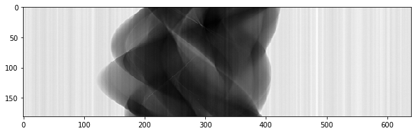
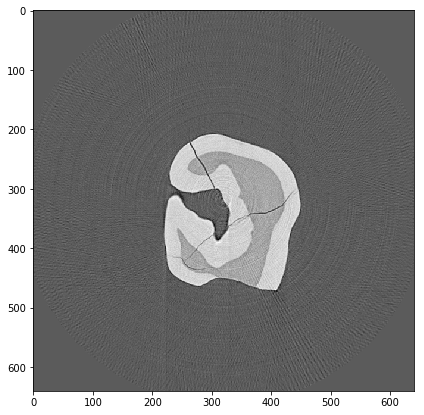
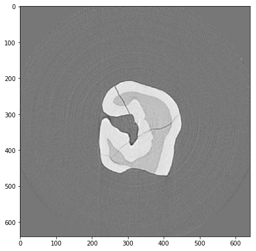
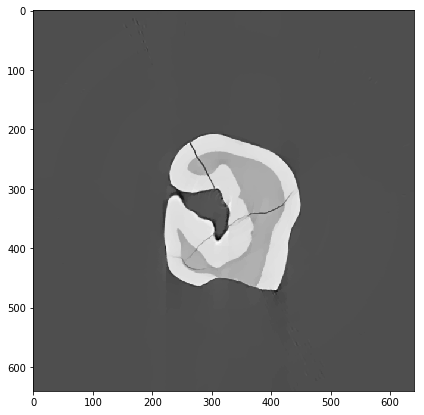

Log-polar based reconstruction
------------------------------

The Log-polar based reconstruction method on GPU :cite`Nikitin:16` is available at
<https://github.com/math-vrn/lprec>.

Here is an example on how to use TomoPy with the Log-polar based method.

.. code:: python

    %pylab inline

.. code:: python

    import tomopy

`DXchange <http://dxchange.readthedocs.io>`__ is installed with tomopy
to provide support for tomographic data loading. Various data format
from all major
`synchrotron <http://dxchange.readthedocs.io/en/latest/source/demo.html>`__
facilities are supported.

.. code:: python

    import dxchange

matplotlib provide plotting of the result in this notebook.
`Paraview <http://www.paraview.org/>`__ or other tools are available for
more sophisticated 3D rendering.

.. code:: python

    import matplotlib.pyplot as plt

Set the path to the micro-CT data to reconstruct.

.. code:: python

    fname = '../../tomopy/data/tooth.h5'

Select the sinogram range to reconstruct.

.. code:: python

    start = 0
    end = 2

This data set file format follows the `APS <http://www.aps.anl.gov>`__
beamline `2-BM and 32-ID <https://www1.aps.anl.gov/Imaging>`__
definition. Other file format readers are available at
`DXchange <http://dxchange.readthedocs.io/en/latest/source/api/dxchange.exchange.html>`__.

.. code:: python

    proj, flat, dark, theta = dxchange.read_aps_32id(fname, sino=(start, end))

Plot the sinogram:

.. code:: python

    plt.imshow(proj[:, 0, :], cmap='Greys_r')
    plt.show()

The log-polar based method only deals with equally spaced angles.

.. code:: python

    theta = tomopy.angles(proj.shape[0])

Perform the flat-field correction of raw data:

.. math::  \frac{proj - dark} {flat - dark} 

.. code:: python

    proj = tomopy.normalize(proj, flat, dark)

Rotation center, manually chosen 

.. code:: python

    rot_center = 296

Calculate

.. math::  -log(proj) 

.. code:: python

    proj = tomopy.minus_log(proj)

.. topic:: Reconstruction with the Log-polar based method

To reconstruct the image with the Log-polar based method instead of TomoPy,
change the ``algorithm`` keyword to ``tomopy.lprec``, put number of cores to 1, and specify the LP method for reconstruction,
together with reconstruction parameters like ``rot_center``, ``filter_name``, ``num_iter``, ``reg_par``

Reconstruciton with FBP:

.. code:: python

   recon = tomopy.recon(proj, theta, center=rot_center, algorithm=tomopy.lprec, lpmethod='lpfbp', filter_name='shepp-logan', ncore=1)

Reconstruction with the Gradient descent method:

.. code:: python

   recon = tomopy.recon(proj, theta, center=rot_center, algorithm=tomopy.lprec, lpmethod='lpgrad', ncore=1, num_iter=64, reg_par=-1)

Reconstruction with the Total Variation method:

.. code:: python

   recon = tomopy.recon(proj, theta, center=rot_center, algorithm=tomopy.lprec, lpmethod='lptv', ncore=1, num_iter=256, reg_par=2e-4)

