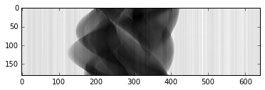
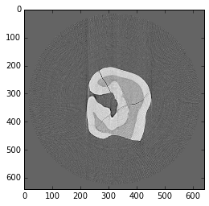

Gridrec
-------

Here is an example on how to use the gridrec :cite:`Dowd:99`
reconstruction algorithm with `TomoPy <http://tomopy.readthedocs.io/en/latest/>`__
:cite:`Gursoy:14a`.  
You can download the python scritp :download:`here<../../../doc/demo/gridrec.py>`
or the Jupyter notebook :download:`here<../../../doc/demo/gridrec.ipynb>`

.. code:: python

    %pylab inline

`Install <http://tomopy.readthedocs.io/en/latest/install.html>`__ TomoPy
then:

.. code:: python

    import tomopy

Tomographic data input in TomoPy is supported by 
`DXchange <http://dxchange.readthedocs.io>`__.

.. code:: python

    import dxchange

matplotlib provide plotting of the result in this notebook.
`Paraview <http://www.paraview.org/>`__ or other tools are available for
more sophisticated 3D rendering.

.. code:: python

    import matplotlib.pyplot as plt

Set the path to the micro-CT data to reconstruct.

.. code:: python

    fname = '../../tomopy/data/tooth.h5'

Select the sinogram range to reconstruct.

.. code:: python

    start = 0
    end = 2

:download:`tooth.h5<../../../tomopy/data/tooth.h5>` data set file format 
follows the `APS <http://www.aps.anl.gov>`__ beamline `2-BM and 32-ID 
<https://www1.aps.anl.gov/Imaging>`__ 
`data-exchange <http://dxfile.readthedocs.io>`__ file format definition.
Major synchrotron file format `examples <http://dxchange.readthedocs.io/en/latest/source/demo.html>`__
are available at `DXchange <http://dxchange.readthedocs.io/en/latest/source/api/dxchange.exchange.html>`__.

.. code:: python

    proj, flat, dark = dxchange.read_aps_32id(fname, sino=(start, end))

Plot the sinogram:

.. code:: python

    plt.imshow(proj[:, 0, :], cmap='Greys_r')
    plt.show()

If the angular information is not avaialable from the raw data you need
to set the data collection angles. In this case theta is set as equally
spaced between 0-180 degrees.

.. code:: python

    theta = tomopy.angles(proj.shape[0])

Perform the flat-field correction of raw data:

.. math::  \frac{proj - dark} {flat - dark} 

.. code:: python

    proj = tomopy.normalize(proj, flat, dark)

Tomopy provides various methods (:cite:`Donath:06`, :cite:`Vo:14`, :cite:`Guizar:08`)
to find the `rotation center <http://tomopy.readthedocs.io/en/latest/api/tomopy.recon.rotation.html>`__.

.. code:: python

    rot_center = tomopy.find_center(proj, theta, init=290, ind=0, tol=0.5)

.. parsed-literal::

    tomopy.rotation:Trying center: [ 290.]
    tomopy.rotation:Trying center: [ 304.5]
    tomopy.rotation:Trying center: [ 275.5]
    tomopy.rotation:Trying center: [ 282.75]
    tomopy.rotation:Trying center: [ 297.25]
    tomopy.rotation:Trying center: [ 304.5]
    tomopy.rotation:Trying center: [ 304.5]
    tomopy.rotation:Trying center: [ 293.625]
    tomopy.rotation:Trying center: [ 290.]
    tomopy.rotation:Trying center: [ 295.4375]
    tomopy.rotation:Trying center: [ 291.8125]
    tomopy.rotation:Trying center: [ 294.53125]
    tomopy.rotation:Trying center: [ 295.4375]
    tomopy.rotation:Trying center: [ 294.078125]

Calculate

.. math::  -log(proj) 

.. code:: python

    proj = tomopy.minus_log(proj)

Reconstruction using Gridrec algorithm.Tomopy provides various
`reconstruction <http://tomopy.readthedocs.io/en/latest/api/tomopy.recon.algorithm.html>`__
methods including the one part of the `ASTRA
toolbox <https://sourceforge.net/p/astra-toolbox/wiki/Home/>`__.

.. code:: python

    recon = tomopy.recon(proj, theta, center=rot_center, algorithm='gridrec')

Mask each reconstructed slice with a circle.

.. code:: python

    recon = tomopy.circ_mask(recon, axis=0, ratio=0.95)

.. code:: python

    plt.imshow(recon[0, :,:], cmap='Greys_r')
    plt.show()

