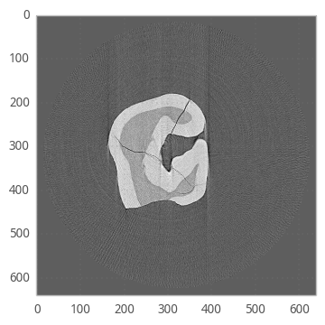

TomoPy with UFO
---------------

Here is an example on how to use `TomoPy
<http://tomopy.readthedocs.io/en/latest/>`__ with UFO and its accompanying
reconstruction algorithms.

`UFO <http://ufo-core.readthedocs.io/en/latest/>`__ is a general-purpose image
processing framework developed at the Karlsruhe Institute of Technology and uses
OpenCL to execute processing tasks on multiple accelerator devices such as
NVIDIA and AMD GPUs, AMD and Intel CPUs as well as Intel Xeon Phi cards.

The `ufo-core <http://ufo-core.readthedocs.io/en/latest/>`__ and `ufo-filters
<http://ufo-filters.readthedocs.io/en/master/>`__ packages must be installed
separately from TomoPy. Make sure to install the Python NumPy interfaces in the
``python`` subdirectory of ufo-core.

For example, to reconstruct using UFO's filtered back-projection algorithm by
setting the algorithm to ``ufo_fbp``. Note, that we *must* set ``ncore`` to 1 in
order to let UFO do the multi-threading. If left to the default value or set to
a value other than 1 will crash the reconstruction.

.. code:: python

    recon = tomopy.recon(proj, theta, center=rot_center, algorithm=ufo_fbp, ncore=1)
    recon = tomopy.circ_mask(recon, axis=0, ratio=0.95)
    plt.imshow(recon[0, :, :], cmap='Greys_r')
    plt.show()

