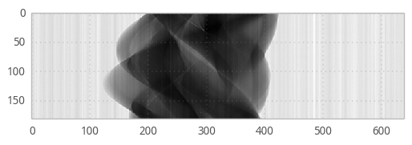

Reconstruction with UFO
-----------------------

`UFO <http://ufo-core.readthedocs.io/en/latest/` is a general-purpose image
processing framework developed at the Karlsruhe Institute of Technology and uses
OpenCL to execute processing tasks on multiple accelerator devices such as
NVIDIA and AMD GPUs, AMD and Intel CPUs as well as Intel Xeon Phi cards.

Here is an example on how to use `TomoPy
<http://tomopy.readthedocs.io/en/latest/>`__ with UFO and its accompanying
reconstruction algorithms.

Install
`TomoPy <http://tomopy.readthedocs.io/en/latest/install.html>`__,
`ufo-core <http://ufo-core.readthedocs.io/en/latest/>`__ and
`ufo-filters <http://ufo-filters.readthedocs.io/en/master/>`__ and
import TomoPy and the TomoPy wrapper for UFO:

.. code:: python

    import tomopy
    import ufo.tomopy

`DXchange <http://dxchange.readthedocs.io>`__ is installed with tomopy
to provide support for tomographic data loading. Various data format
from all major
`synchrotron <http://dxchange.readthedocs.io/en/latest/source/demo.html>`__
facilities are supported.

.. code:: python

    import dxchange

matplotlib allows us to plot the result in this notebook.

.. code:: python

    import matplotlib.pyplot as plt

Set the path to the micro-CT dataset and the sinogram range to
reconstruct.

.. code:: python

    fname = 'tooth.h5'
    start, end = (0, 2)

This dataset file format follows the `APS <http://www.aps.anl.gov>`__
beamline `2-BM and 32-ID <https://www1.aps.anl.gov/Imaging>`__
definition. Other file format readers are available at
`DXchange <http://dxchange.readthedocs.io/en/latest/source/api/dxchange.exchange.html>`__.

.. code:: python

    proj, flat, dark, theta = dxchange.read_aps_32id(fname, sino=(start, end))

Plot the sinogram:

.. code:: python

    plt.imshow(proj[:, 0, :], cmap='Greys_r')
    plt.show()

If the angular information is not available from the raw data you need
to set the data collection angles. In this case theta is set as equally
spaced between 0-180 degrees.

.. code:: python

    theta = tomopy.angles(proj.shape[0])

Perform the flat-field correction of raw data:

.. math::  \frac{proj - dark} {flat - dark} 

.. code:: python

    proj = tomopy.normalize(proj, flat, dark)

Tomopy provides various methods to `find rotation
center <http://tomopy.readthedocs.io/en/latest/api/tomopy.recon.rotation.html>`__.

.. code:: python

    center = tomopy.find_center(proj, theta, init=290, ind=0, tol=0.5)

Calculate

.. math::  -\log(proj) 

.. code:: python

    proj = tomopy.minus_log(proj)

Now, reconstruct using UFO's filtered backprojection algorithm. Note,
that we *must* set ``ncore`` to 1 in order to let UFO do the
multi-threading. If left to the default value or set to a value other
than 1 will crash the reconstruction.

.. code:: python

    recon = tomopy.recon(proj, theta, center=center, algorithm=ufo.tomopy.fbp, ncore=1)

Mask each reconstructed slice with a circle.

.. code:: python

    recon = tomopy.circ_mask(recon, axis=0, ratio=0.95)

.. code:: python

    plt.imshow(recon[0, :,:], cmap='Greys_r')
    plt.show()

.. image:: ufo_files/ufo_26_0.png
