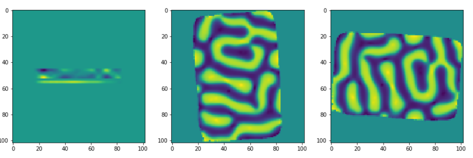
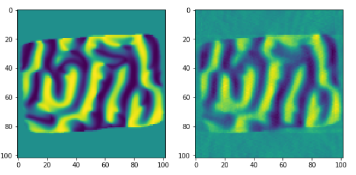
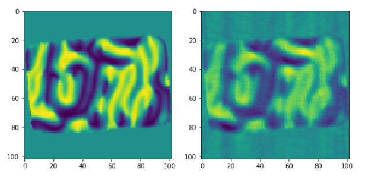
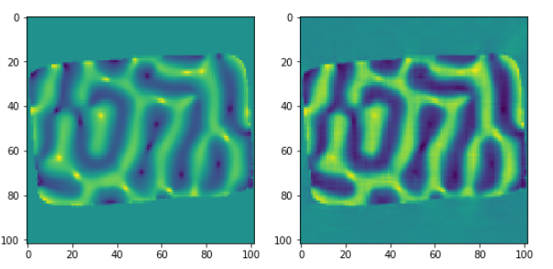

Vector Reconstruction
---------------------

The vector reconstruction algorithm can be used for instance, to reconstruct the magnetization vector field inside a magnetic sample.

Here is an example on how to use the vector reconstruction algorithm :cite:`Phatak:15` :cite:`Hierro-Rodriguez:18`
with `TomoPy <http://tomopy.readthedocs.io/en/latest/>`__:cite:`Gursoy:14a`.  

**From a reconstructed 3D object to its projections and back**

In order to test the algorithm, the projections of a reconstructed oject can be computed, and from these projections we can come back to the reconstructed model object. Finally we will compare the results of the vector field reconstruction against the initial object.

All datasets used in this tutorial are available in `tomoBank <https://tomobank.readthedocs.io/en/latest/source/phantom/docs.phantom.magnetic.html>`_.

First, let's make the necessary imports

.. code:: python

    import dxchange
    import tomopy
    import numpy as np
    import matplotlib.pyplot as plt
    import time

Let's load the object: the three components of the magnetization vector all throughout the object. The object will be padded in order to have a cubic object. Afterwards it will be downsampled to make faster computations.

.. code:: python

    obx = dxchange.read_tiff('M4R1_mx.tif').astype('float32')
    oby = dxchange.read_tiff('M4R1_my.tif').astype('float32')
    obz = dxchange.read_tiff('M4R1_mz.tif').astype('float32')

    npad = ((182, 182), (64, 64), (0, 0))
    obx = np.pad(obx, npad, mode='constant', constant_values=0)
    oby = np.pad(oby, npad, mode='constant', constant_values=0)
    obz = np.pad(obz, npad, mode='constant', constant_values=0)

    obx = tomopy.downsample(obx, level=2, axis=0)
    obx = tomopy.downsample(obx, level=2, axis=1)
    obx = tomopy.downsample(obx, level=2, axis=2)

    oby = tomopy.downsample(oby, level=2, axis=0)
    oby = tomopy.downsample(oby, level=2, axis=1)
    oby = tomopy.downsample(oby, level=2, axis=2)

    obz = tomopy.downsample(obz, level=2, axis=0)
    obz = tomopy.downsample(obz, level=2, axis=1)
    obz = tomopy.downsample(obz, level=2, axis=2)

Define the projection angles: 31 angles, from 90 to 270 degrees:

.. code:: python

    ang = tomopy.angles(31, 90, 270)

And calculate the projections of the object taking rotation axes around the three perpendicular cartesian axes:

.. code:: python

    prj1 = tomopy.project3(obx, oby, obz, ang, axis=0, pad=False)
    prj2 = tomopy.project3(obx, oby, obz, ang, axis=1, pad=False)
    prj3 = tomopy.project3(obx, oby, obz, ang, axis=2, pad=False)

The three coordinates of a given projection can be visualized as follows:

.. code:: python

    fig = plt.figure(figsize=(15, 8))
    ax1 = fig.add_subplot(1, 3, 1)
    ax1.imshow(obx[52,:,:])
    ax2 = fig.add_subplot(1, 3, 2)
    ax2.imshow(oby[52,:,:])
    ax3 = fig.add_subplot(1, 3, 3)
    ax3.imshow(obz[52,:,:])

Finally we will reconstruct the vector field components, taking as input the projections that we have calculated thanks to the first 3D initial object.  
The number of iterations can be adapted to have a faster but more imprecise reconstruction, or to have a more precise reconstruction.

.. code:: python

    rec1, rec2, rec3 = tomopy.vector3(prj1, prj2, prj3, ang, ang, ang, axis1=0, axis2=1, axis3=2, num_iter=100)
    dxchange.write_tiff(rec1)
    dxchange.write_tiff(rec2)
    dxchange.write_tiff(rec3)

**Comparison of results against input object**

In this section, we compare the results of the vector field components obtained thanks to the tomopy reconstruction, against the vector field components of the object given as input:

Comparison of the first magnetization vector component against the input data object (for a given slice).

.. code:: python

    fig = plt.figure(figsize=(9, 7))
    ax1 = fig.add_subplot(1, 2, 1)
    ax1.imshow(obx[52,:,:])
    ax2 = fig.add_subplot(1, 2, 2)
    ax2.imshow(rec1[52,:,:])

Comparison of the second magnetization vector component against the input data object (for a given slice):

.. code:: python

    fig = plt.figure(figsize=(9, 7))
    ax1 = fig.add_subplot(1, 2, 1)
    ax1.imshow(oby[52,:,:])
    ax2 = fig.add_subplot(1, 2, 2)
    ax2.imshow(rec2[52,:,:])
    

Comparison of the third magnetization vector component against the input data object (for a given slice):

.. code:: python

    fig = plt.figure(figsize=(9, 7))
    ax1 = fig.add_subplot(1, 2, 1)
    ax1.imshow(obz[52,:,:])
    ax2 = fig.add_subplot(1, 2, 2)
    ax2.imshow(rec3[52,:,:])

**Other examples**

Three jupyter notebooks with examples as well as with some mathematical concepts related to the vector reconstruction,
can be found in the tomopy/doc/demo folder:

Examples using vector3: input data projections from 3 orthogonal tilt angles:

* vectorrec_1.ipynb

* vectorrec_disk.ipynb

Example using vector2: input data projections from 2 orthogonal tilt angles:

* vector_heterostructure.ipynb

The Vector Reconstruction examples html slides can be build by applying (from the doc/demo folder) the following commands:

``jupyter-nbconvert --to slides --post serve vectorrec_1.ipynb``

``jupyter-nbconvert --to slides --post serve vectorrec_disk.ipynb``

``jupyter-nbconvert --to slides --post serve vector_heterostructure.ipynb``

